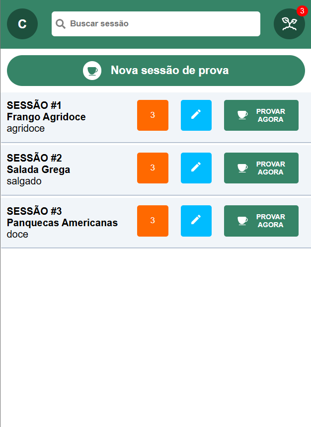
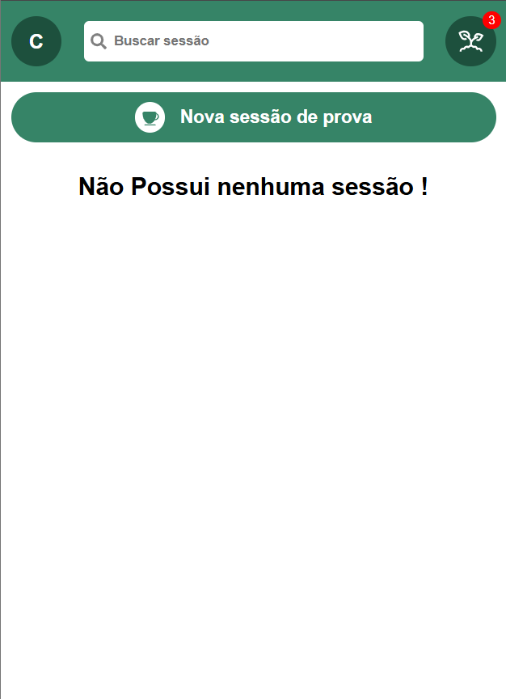

# Desafio Agroger 2025

 

## Projeto Finalizado:
<div style="display: flex; justify-content: space-between;">
  
  
</div>

## Funcionalidades

- **Botão "Nova Sessão de Prova"**: Ao clicar no botão, a aplicação faz uma requisição HTTP e exibe uma lista de dados de um endpoint público.

## Tecnologias Utilizadas

- **React**: Biblioteca para construção de interfaces de usuário.
- **Vite**: Ferramenta de build moderna e rápida.
- **Sass**: Pré-processador CSS para facilitar a estilização.
- **React Icons**: Para ícones no projeto.
- **Axios**: Biblioteca para realizar requisições HTTP.

## Como Rodar o Projeto

### Passos Iniciais

1. Clone este repositório:
   ```bash
   git clone https://github.com/rafahthomaz14/Desafio_Agroger_2025.git


2. Acesse o diretório do projeto:
   ```bash
   cd Desafio_Agroger_2025


3. Instale as dependências com o npm:
   ```bash
   npm install


4. Execute o servidor de desenvolvimento:
   ```bash
   npm run dev

